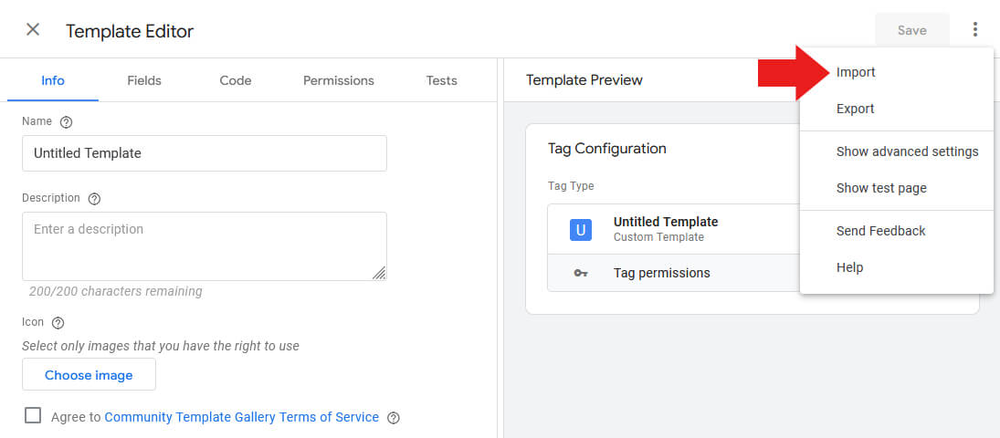
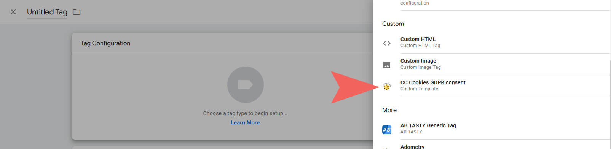
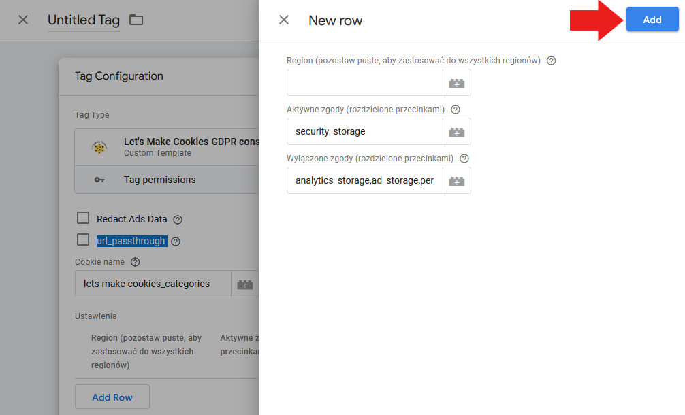
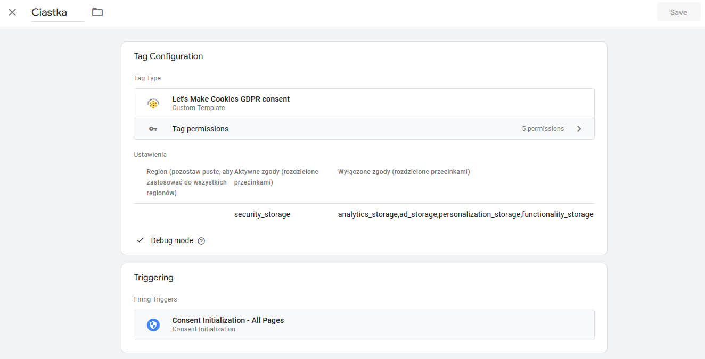
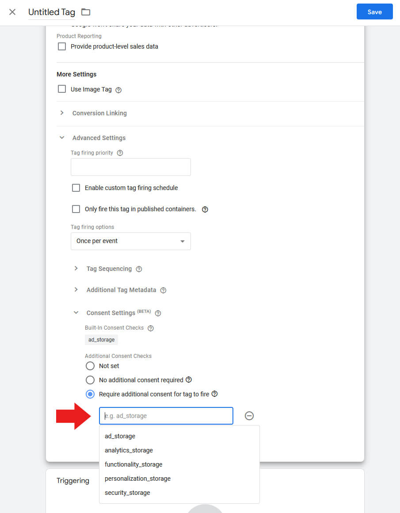
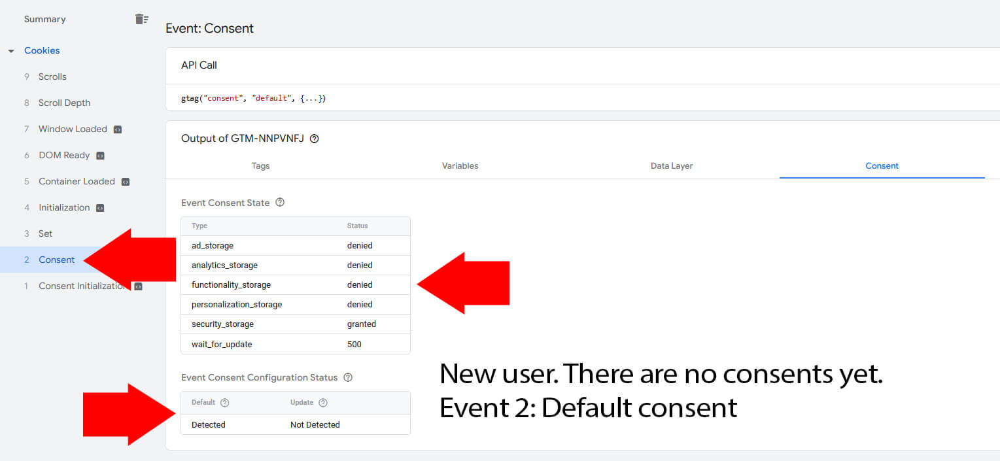
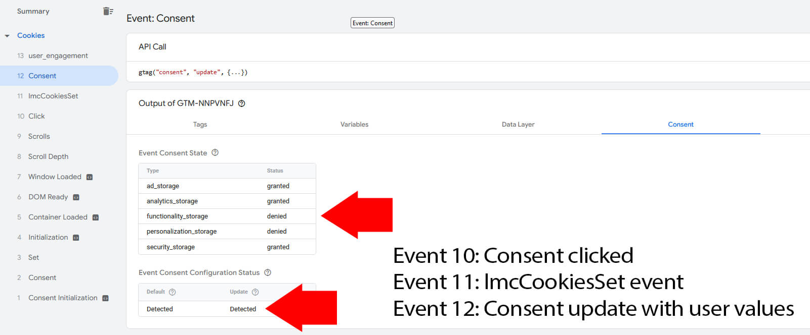

# CookieConsent v3 skonfigurowane pod Consent Mode v2 + szablon tagu GTM.

**Demo:** [https://balabon.unixstorm.org/ccc/](https://balabon.unixstorm.org/ccc/)

**Typ:** Uniwersalny plugin JS

**Bazuje na:** [orestbida/cookieconsent](https://github.com/orestbida/cookieconsent)

***

## Instalacja
1. Pobierz zip lub uruchom git pull.
2. Dodaj katalog ./cc do projektu.
3. Wczytaj CSS z cdn lub lokalnie:
   - \<link rel="stylesheet" \href="https://cdn.jsdelivr.net/gh/orestbida/cookieconsent@v3.0.0-rc.17/dist/cookieconsent.css">
4. Wczytaj JS:
   - 

**JS - konfiguracja**

./cc/js/cookieconsent-config.js

**CSS**

./cc/style.css

**Oryginalna dokumentacja:** [CookieConsent v3](https://cookieconsent.orestbida.com/)

***

## Tag GTM
1. Pobierz szablon tagu GTM CC Cookies GDPR consent GTM template.tpl
2. Zaimportuj szablon w GTM

3. Stwórz nowy tag korzystając z zaimportowanego szablonu.

4. Dodaj wiersz z domyślnymi ustawieniami zgód. Możesz dostosować ustawienia ilub dodać wiele wierszy dla różnych regionów.

5. Ustaw wyzwalacz tagu na Consent Initialization - All Pages.

6. Jeżeli korzystasz z innych tagów, ustaw im wymagane zgody.

## Debugowanie Tagu
1. Jeżeli chcesz, włącz logowanie zdarzeń w konsoli (debug mode) w ustawieniach tagu.
2. Uruchom debug view w GTM.
3. Przed ustawieniem zgód przez użytkownika, GTM otrzyma zgody defaultowe z ustawień tagu.

4. Po zdarzeniu ustawienia zgód (CookiesSet), GTM otrzyma aktualizacje zgód na wybrane przez użytkownika.

## Debugowanie GA
Możesz dodatkowo zweryfikować Consent Mode w GA:

1. Wczytaj stronę bez zgody na analytics_storage.
2. Sprawdź parametr **gcs** wysyłany przez analytics.google.com/g/collect w konsoli:

 | gcs | description |
 | --- | --- |
 | G100 | Consent for both ad_storage and analytics_storage is denied. |
 | G110 | Consent is granted for ad_storage and denied for analytics_storage. |
 | G101 | Consent is denied for ad_storage and granted for analytics_storage. |
 | G111 | Consent for both ad_storage and analytics_storage is granted. |
 | G1-- | The site did not require consent for ad_storage or analytics_storage. |

> [!NOTE]
> Pamiętaj, żeby ustawić anonymizeIp=true w tagu GA.