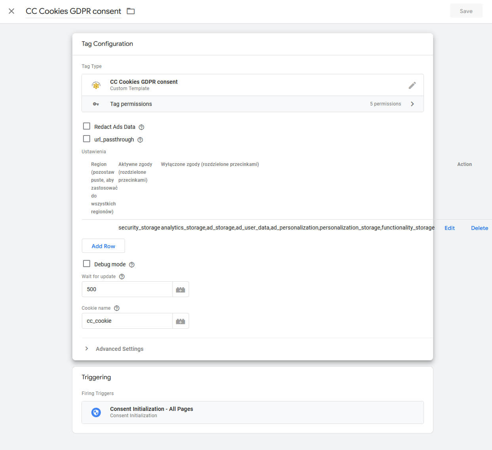
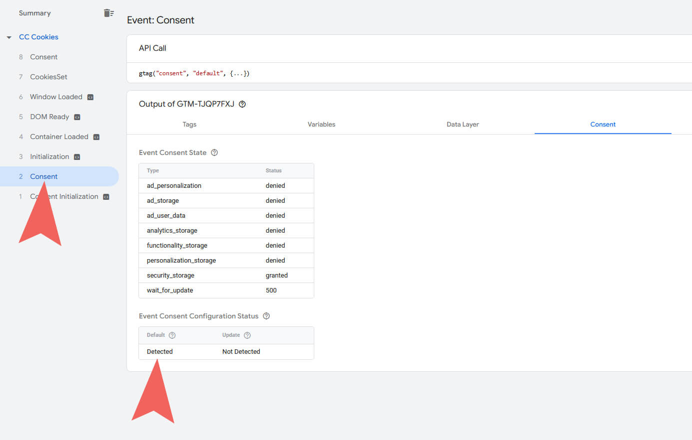
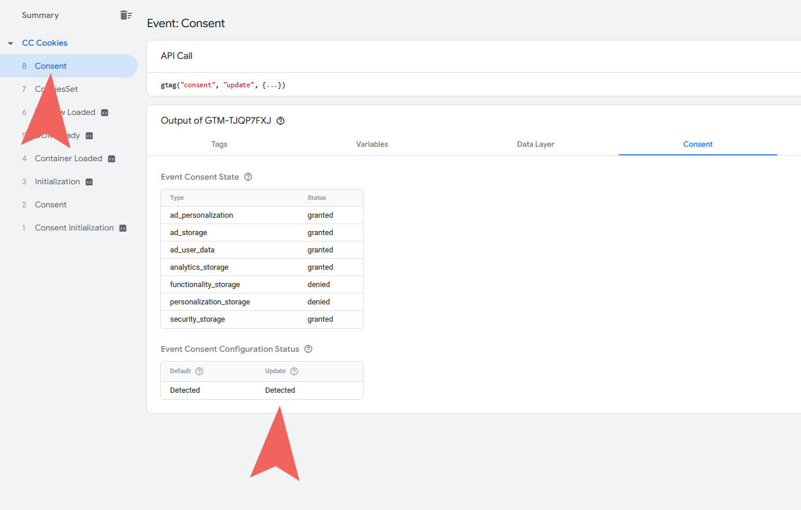

# CookieConsent v3 skonfigurowane pod Consent Mode v2 + szablon tagu GTM.

**Demo:** [https://balabon.unixstorm.org/ccc/](https://balabon.unixstorm.org/ccc/)

**Typ:** Uniwersalny plugin JS

**Bazuje na:** [orestbida/cookieconsent](https://github.com/orestbida/cookieconsent)

***

## Instalacja
1. Pobierz zip lub uruchom git clone.
2. Dodaj katalog ./cc do projektu.
3. Wczytaj CSS z cdn lub lokalnie:
   - \<link rel="stylesheet" href="./cc/css/cookieconsent.css">
   - \<link rel="stylesheet" href="./cc/css/iframemanager.css">
4. Wczytaj JS:
   - 
   - 

**JS - konfiguracja**

./cc/js/cookieconsent-config.js

./cc/js/iframemanager-config.js

**CSS**

./cc/style.css

**Tłumaczenia**
**Uwaga:** W konfiguracji ścieżek do plików językowych należy używać ścieżek bezwględnych. Ścieżki względne powodują błąd - moduł nie jest widoczny na podstronach.

**Oryginalna dokumentacja:** 

[CookieConsent v3](https://cookieconsent.orestbida.com/)

[iframemanager](https://github.com/orestbida/iframemanager)

***

## Tag GTM
1. Pobierz szablon tagu GTM CC Cookies GDPR consent GTM template.tpl
2. Zaimportuj szablon w GTM

3. Stwórz nowy tag korzystając z zaimportowanego szablonu.

4. Dodaj wiersz z domyślnymi ustawieniami zgód. Możesz dostosować ustawienia i / lub dodać wiele wierszy dla różnych regionów.

5. Ustaw wyzwalacz tagu na Consent Initialization - All Pages.

6. Jeżeli korzystasz z innych tagów, ustaw im wymagane zgody.

### Domyślne kategorie zgód Google

 | nazwa | opis |
 | --- | --- |
 | ad_storage | Umożliwia przechowywanie danych (np. plików cookie) związanych z reklamami. |
 | analytics_storage  | Umożliwia przechowywanie danych (np. plików cookie) dotyczących statystyk, np. czasu trwania wizyty. |
 | functionality_storage | Umożliwia przechowywanie danych, które obsługują funkcje witryny lub aplikacji, np. ustawień języka. |
 | personalization_storage | Umożliwia przechowywanie danych dotyczących personalizacji, np. rekomendacji filmów. |
 | security_storage | Umożliwia przechowywanie danych związanych z zabezpieczeniami, takimi jak funkcja uwierzytelniania, zapobieganie oszustwom i inne mechanizmy ochrony użytkowników. |

### Nowe kategorie w Consent Mode v2

 | nazwa | opis |
 | --- | --- |
 | ad_user_data | Zgoda na wysyłanie do Google danych użytkownika związanych z reklamami. |
 | ad_personalization | Zgoda na reklamy spersonalizowane. |

## Debugowanie Tagu
1. Jeżeli chcesz, włącz logowanie zdarzeń w konsoli (debug mode) w ustawieniach tagu.
2. Uruchom debug view w GTM.
3. Przed ustawieniem zgód przez użytkownika, GTM otrzyma zgody defaultowe z ustawień tagu.

4. Po zdarzeniu ustawienia zgód (CookiesSet), GTM otrzyma aktualizacje zgód na wybrane przez użytkownika.

5. Jeżeli użytkownik był już na stronie i zapisał zgody, GTM od razu otrzyma aktualizacje zgód na wybrane przez użytkownika.

## Debugowanie GA
Możesz dodatkowo zweryfikować Consent Mode w GA:

1. Wczytaj stronę bez zgody na analytics_storage.
2. Sprawdź parametr **gcs** wysyłany przez analytics.google.com/g/collect w konsoli:

 | gcs | description |
 | --- | --- |
 | G100 | Odmowa udzielenia zgody zarówno na ad_storage, jak i w przypadku elementu analytics_storage. |
 | G110 | Udzielono zgody w przypadku: ad_storage i odmówiono w przypadku: analytics_storage. |
 | G101 | Udzielono zgody w przypadku: ad_storage, a w przypadku: analytics_storage. |
 | G111 | Udzielono zgody zarówno na ad_storage, jak i na analytics_storage. |
 | G1-- | Witryna nie wymagała zgody w przypadku tych domen: ad_storage ani analytics_storage. |

 > [!NOTE]
> Pamiętaj, żeby ustawić anonymizeIp=true w tagu GA.

***

## Zaawansowane

**ads_data_redaction**

> [!NOTE]
> Sprawdź, czy domeny bez plików cookie (np. googledistribution.com) są używane, gdy ads_data_redaction ma wartość true.

**url_passthrough**
> [!NOTE]
> Sprawdź, czy tagi gclid/dclid są dołączane do wychodzących adresów URL, gdy parametr url_passthrough ma wartość true i czy występuje parametr łączący _gl (np. https://www.example.com/?_gl=1*abcde5*).